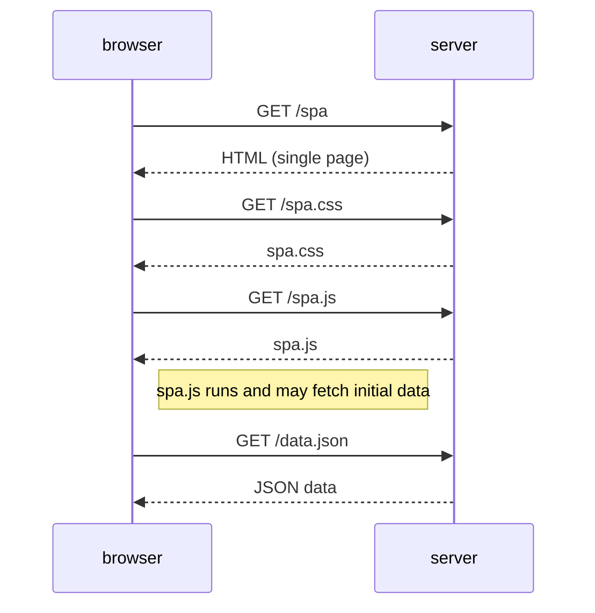

# 0.5 — SPA page load

# 0.5 — SPA page load

```mermaid
sequenceDiagram
  participant browser
  participant server

  browser->>server: GET /spa
  server-->>browser: HTML (single page)
  browser->>server: GET /spa.css
  server-->>browser: spa.css
  browser->>server: GET /spa.js
  server-->>browser: spa.js
  Note right of browser: spa.js runs and may fetch initial data
  browser->>server: GET /data.json
  server-->>browser: JSON data
```

Comments:
- SPA fetches a single HTML page and dynamic JS; the JS can fetch JSON and render the UI without full page reloads.
