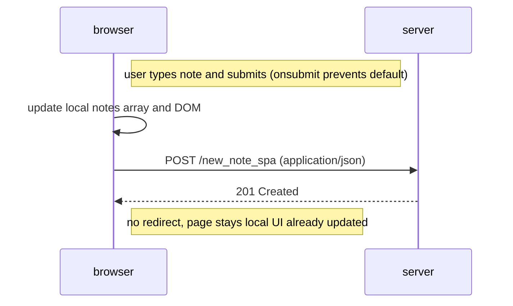

# 0.6 — New note in SPA

Comments:
- SPA prevents default form submit, updates local state/DOM immediately, and sends JSON via XHR/fetch.
- The server responds with 201; no further full-page reloads occur.
